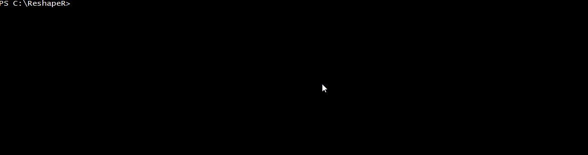

# ReshapeR

Image reshaping utility for smart scene resizing based on the content-aware SeamCarving algorithm.


## Details

ReshapeR is based on SeamCarving algorithm and allows one to resize an image in a smart way using content aware least energy seam detection. The algorithm itself takes place in a few phases. First the Energy grid of the image is calculated and a gradient - contrast output image is obtained. Second the least energy vertical or horizontal path through the image is determined. And lastly, the pixels corresponding to that path are removed. This way the most important elements of the image are preserved as well as the general aspect ratio of those elements and a new "condensed" image is obtained.

**Example**


## Demo



## Package

- ReshapeR utility
- Image energy printing utility
- Image seams displaying utility
- Test files are located in the test folder

## Usage

- Go to the `ReshapeR` folder.

- Compile
```shell
C:\ReshapeR> javac -cp "C:\ReshapeR;C:\ReshapeR\lib\algs4.jar" ShowSeams.java
C:\ReshapeR> javac -cp "C:\ReshapeR;C:\ReshapeR\lib\algs4.jar" ShowEnergy.java
C:\ReshapeR> javac -cp "C:\ReshapeR;C:\ReshapeR\lib\algs4.jar" SeamCarver.java
C:\ReshapeR> javac -cp "C:\ReshapeR;C:\ReshapeR\lib\algs4.jar" SCUtility.java
C:\ReshapeR> javac -cp "C:\ReshapeR;C:\ReshapeR\lib\algs4.jar" ResizeDemo.java
C:\ReshapeR> javac -cp "C:\ReshapeR;C:\ReshapeR\lib\algs4.jar" PrintSeams.java
C:\ReshapeR> javac -cp "C:\ReshapeR;C:\ReshapeR\lib\algs4.jar" PrintEnergy.java

```

- Run using command line options:

```shell
C:\ReshapeR> java -cp "C:\ReshapeR;C:\ReshapeR\lib\algs4.jar" ShowEnergy /test/chameleon.png
C:\ReshapeR> java -cp "C:\ReshapeR;C:\ReshapeR\lib\algs4.jar" ShowSeams /test/chameleon.png
C:\ReshapeR> java -cp "C:\ReshapeR;C:\ReshapeR\lib\algs4.jar" ResizeDemo /test/chameleon.png 100 0

```

## How to Contribute

1. Clone repo and create a new branch: `$ git checkout https://github.com/DumitruHanciu/ReshapeR -b new_branch`.
2. Make changes and test
3. Submit Pull Request with comprehensive description of changes


## License

[](http://badges.mit-license.org)

- **[MIT license](http://opensource.org/licenses/mit-license.php)**
